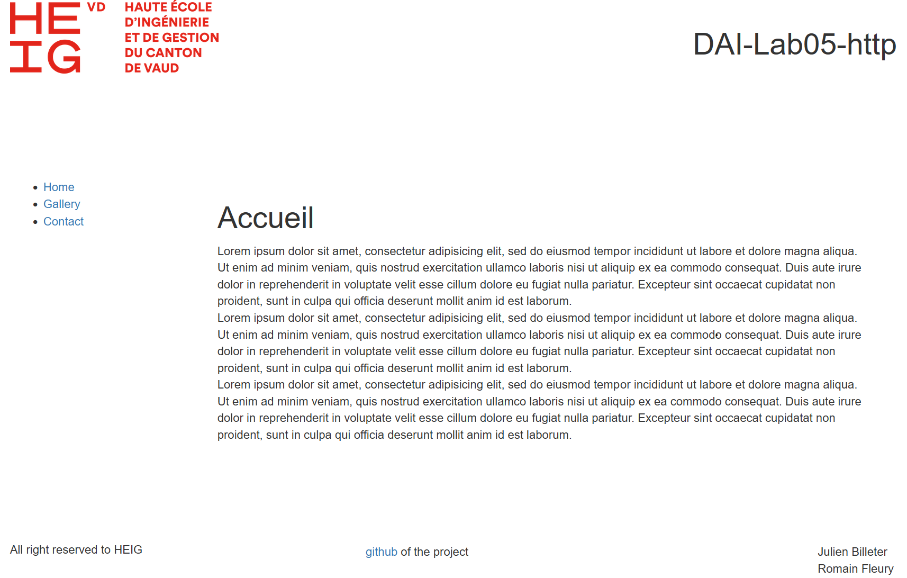

### DAI Lab - HTTP infrastructure

## Romain Fleury, Dr. Ing. Julien Billeter


## Step 1: Static Web site

### You are able to explain the content of the nginx.conf file.

La configuration de base de *nginx* se trouve dans ```etc/nginx/nginx.conf```. Le contenu de ce fichier est le suivant :
```
user              nginx;
worker_processes  auto;

error_log  /var/log/nginx/error.log notice;
pid        /var/run/nginx.pid;

events {
    worker_connections  1024;
}

http {
    include       /etc/nginx/mime.types;
    default_type  application/octet-stream;

    log_format  main  '$remote_addr - $remote_user [$time_local] "$request" '
                      '$status $body_bytes_sent "$http_referer" '
                      '"$http_user_agent" "$http_x_forwarded_for"';

    access_log  /var/log/nginx/access.log  main;

    sendfile        on;
    #tcp_nopush     on;

    keepalive_timeout  65;

    #gzip  on;

    include /etc/nginx/conf.d/*.conf;
}
```
Les directives du fichier de configuration de base sont expliquées ci-dessous :
- ```user nginx``` : utilisateur sous lequel ```nginx``` est lancé
- ```worker_processes auto``` : nombre de processus ```worker``` que *nginx* doit utiliser (*auto* permettant de déterminer automatiquement le nombre optimal de processus en fonction des capacités du système)
- ```error_log /var/log/nginx/error.log notice``` : chemin du journal d'erreurs et le niveau de gravité des messages à enregistrer (les messages de niveau *notice* (et plus graves) sont enregistrés)
- ```pid /var/run/nginx.pid``` : chemin d'un fichier dans lequel le PID (*Process ID*) de *nginx* est enregistré
- ```events { ... }``` : section définissant les paramètres liés aux événements
- ```worker_connections 1024``` : nombre maximum de connexions par worker
- ```http { ... }``` : section définissant les paramètres liés à la configuration HTTP
- ```include /etc/nginx/mime.types``` : emplacement du fichier de types MIME, qui associe les extensions de fichiers aux types de contenu
- ```default_type application/octet-stream``` : type MIME par défaut à utiliser lorsque le type ne peut pas être déterminé
- ```log_format main ...``` : format des journaux d'accès (par exemple, des informations sur l'adresse IP du client, l'utilisateur distant, l'heure de la requête, etc...)
- ```access_log /var/log/nginx/access.log main;``` : chemin du journal d'accès et format des journaux à utiliser
- ```sendfile on``` : active l'utilisation de la fonction *sendfile* pour la transmission de fichiers statiques à partir du disque vers le client
- ```keepalive_timeout 65``` : délai d'attente maximum pour les connexions persistantes avec le client
- ```include /etc/nginx/conf.d/*.conf``` : inclut tous les fichiers de configuration se terminant par ```.conf``` dans le répertoire spécifié

### You have documented your configuration in your report.

La configuration particulière du serveur virtuel HTTP est incluse dans la configuration de base de *nginx* via la dernière ligne du fichier ```etc/nginx/nginx.conf```. La configuration particulière se trouve le fichier ```/etc/nginx/conf.d/default.conf``` :
```
server {
listen       80;
listen  [::]:80;
server_name  localhost;
    location / {
        root   /usr/share/nginx/html;
        index  index.html index.htm;
    }
    error_page   500 502 503 504  /50x.html;
    location = /50x.html {
        root   /usr/share/nginx/html;
    }
}
```
Les directives du fichier de configuration particulière sont expliquées ci-dessous :
- ```server { ... }``` : section définissant un bloc de configuration spécifique au serveur virtuel
- ```listen 80;```: le serveur écoute les connexions sur le port 80 pour les requêtes HTTP
- ```listen [::]:80``` : le serveur accepte les connexions IPv6 sur le port 80
- ```server_name localhost``` : définit le nom du serveur virtuel (réponses aux requêtes pour le domaine *localhost*).
- ```location / { ...}``` : section définissant la configuration d'une directive de localisation (cette section s'applique à l'URL racine (```/```)
- ```root /usr/share/nginx/html``` : répertoire racine où les fichiers à servir pour cette localisation doivent être pris
- ```index index.html index.htm``` : ordre de recherche des fichiers *index* lorsqu'une requête est faite sur le répertoire (dans ce cas, recherche d'abord "index.html", puis "index.htm")
- ```error_page 500 502 503 504 /50x.html``` : page à afficher en cas d'erreur de serveur (redirige vers */50x.html*)
- ```location = /50x.html { ... }``` : section définissant la configuration d'une directive de localisation pour */50x.html*
- ```root /usr/share/nginx/html``` : répertoire où se trouve le fichier */50x.html*

## Step 2: Docker compose

### You have documented your configuration in your report
Le fichier ```Dockerfile``` permet de *dockeriser* le site HTTP. Le contenu de ce fichier est le suivant : 
```
FROM nginx
COPY www /usr/share/nginx/html
```
La directive ```FROM nginx``` indique l'image de base pour la construction de la nouvelle image Docker (en l'occurrence l'image officielle de *Nginx*, disponible sur *Docker Hub*). 
La directive ```COPY www /usr/share/nginx/html``` copie le contenu du répertoire local ```www``` dans le répertoire ```/usr/share/nginx/html``` de l'image Docker en cours de construction.

Une fois l'image docker crée, il est possible de la lancer avec une configuration spécifiée à l'aide du fichier *docker-compose.yml* décrit ci-dessous :
```
version: '3.8'
services:
    #loadbalancer:
    #  image: traefik:v2.5
    #  ports:
    #    - "80:80"
    webserver:
    image: dai_http:latest
    ports:
        - "80:80"
    #  deploy:
    #    replicas: 5
```
Les directives du fichier *docker-compose.yml* sont expliquées ci-dessous :
- ```version: '3.8'``` : version de la syntaxe utilisée dans le fichier docker-compose.yml
- ```services``` : section des services dans un fichier Docker Compose (i.e. conteneurs qui sont exécutés)
- ```webserver```: nom du service à déclarer (i.e. un service appelé *webserver*)
- ```image: dai_http:latest``` : nom de l'image Docker à utiliser pour ce service
- ```ports: - "80:80"``` : mapping de ports entre le système hôte (à gauche) et le conteneur Docker (à droite)
La mapping de port indique que les requêtes HTTP faites au port 80 de la machine hôte seront redirigées vers le port 80 du conteneur *webserver* (*dai_http* version la plus récente, dans le cas présent).
les commentaires (préfixés par ```#```) indiquent la configuration possible d'un *load balancer* (voir plus loin).

En lançant la commande ```docker compose up -d``` (avec ```-d``` pour le mode *détaché*), on lance le serveur HTTP sur le port 80 de la machine locale.
Dans un navigateur, en tappant l'adresse ```localhost:80```, on trouve le contenu de la page statique (page *index.html*), comme le montre la copie d'écran ci-dessous :



